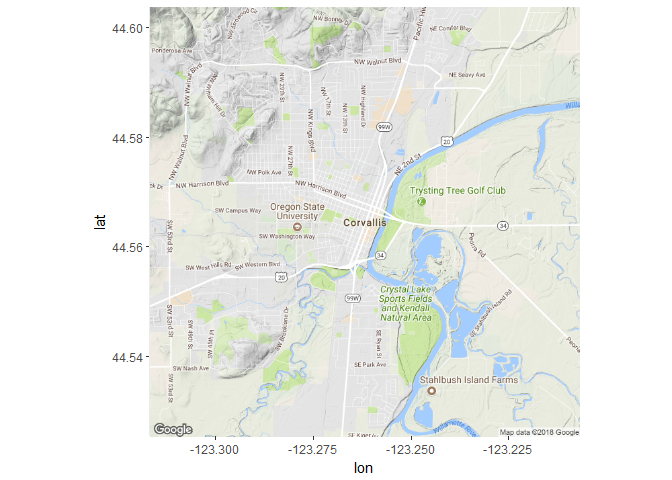
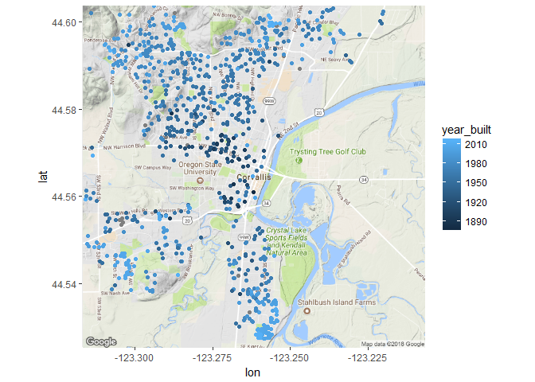
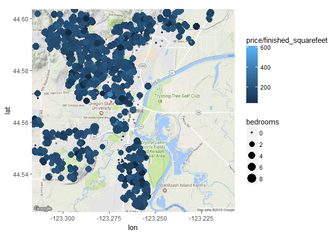

## Working with Geospatial data in R

Code from [the datacamp course](https://campus.datacamp.com/courses/working-with-geospatial-data-in-r/) by this name.  Datasets used available [from github](https://github.com/cwickham/geospatial/tree/master/data)


```r
library(ggmap)
```

```
## Loading required package: ggplot2
```

```r
corvallis <- c(lon = -123.2620, lat = 44.5646)
corvallis_map <- get_map(location=corvallis, zoom = 13, scale = 1)
```

```
## Map from URL : http://maps.googleapis.com/maps/api/staticmap?center=44.5646,-123.262&zoom=13&size=640x640&scale=1&maptype=terrain&language=en-EN&sensor=false
```

```r
ggmap(corvallis_map)
```

<!-- -->

```r
load("sales.rda")
ggmap(corvallis_map) +
  geom_point(aes(lon, lat, color=year_built), data = sales)
```

<!-- -->

```r
ggmap(corvallis_map) +
  geom_point(aes(lon, lat, color=price/finished_squarefeet, size=bedrooms), data = sales)
```

<!-- -->

